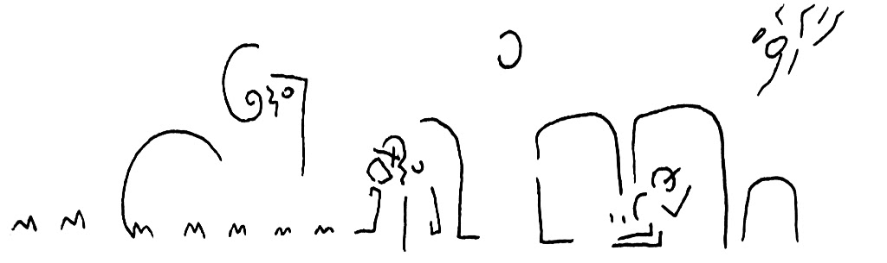
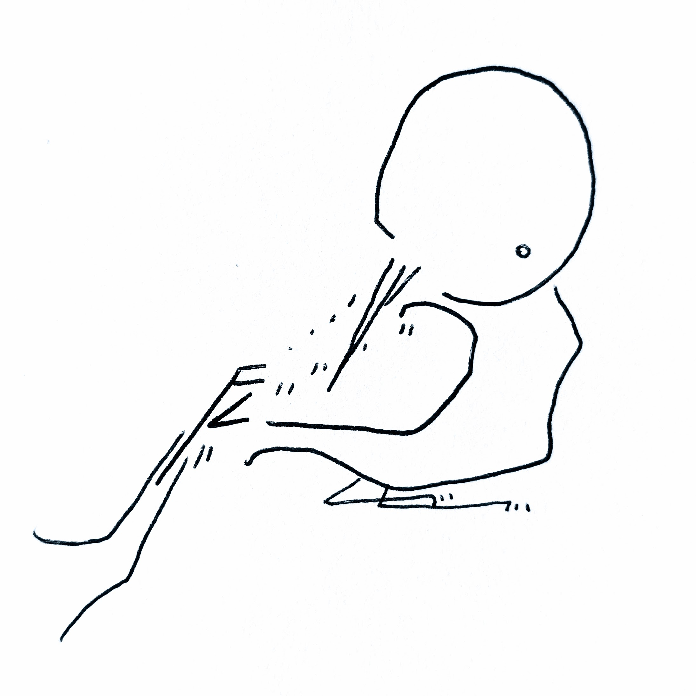

 
 
 
 
 
 
 

 

# Hello! :)

My name is Kourosh Alizadeh and I'm a data and solutions architect. Originally from the UK and of Persian descent, I hold a PhD in philosophy and have a strong background in education, research, and the public sector. My hobbies include thinking about fish, watching horror movies, and random artsy stuff. 

## This & That

🔭 Working on the Philosophy Data Project (<www.philosophydata.com>Philosophy Data Project</www.philosophydata.com> - NLP with texts from the history of philosophy 
👯 Would love to collaborate on NLP projects or research on data in the liberal arts; feel free to reach out! 
📓 [Toontoony the Magpie](https://www.amazon.com/Toontoony-Magpie-Kourosh-Alizadeh-ebook/dp/B007XVJQ04/ref=sr_1_1?dchild=1&keywords=toontoony&sr=8-1), a book of (very) short stories I wrote 
 
 
Feel free to reach out via [![email][3.1]](mail-fill.png)](mailto:kcalizadeh@gmail.com)[email](mailto:kcalizadeh@gmail.com) or [![LinkedIn][3.2]](https://www.linkedin.com/in/kourosh-alizadeh-phd-68b51861/) [LinkedIn](https://www.linkedin.com/in/kourosh-alizadeh-phd-68b51861/).
Thanks!

[3.2]: linkedin-box-fill.png
[3.1]: mail-fill.png

<!-- 

 -->

<!--

**kcalizadeh/kcalizadeh** is a ✨ _special_ ✨ repository because its `README.md` (this file) appears on your GitHub profile.

Here are some ideas to get you started:

- 🔭 I’m currently working on ...
- 🌱 I’m currently learning ...
- 👯 I’m looking to collaborate on ...
- 🤔 I’m looking for help with ...
- 💬 Ask me about ...
- 📫 How to reach me: ...
- 😄 Pronouns: ...
- ⚡ Fun fact: ...
-->
